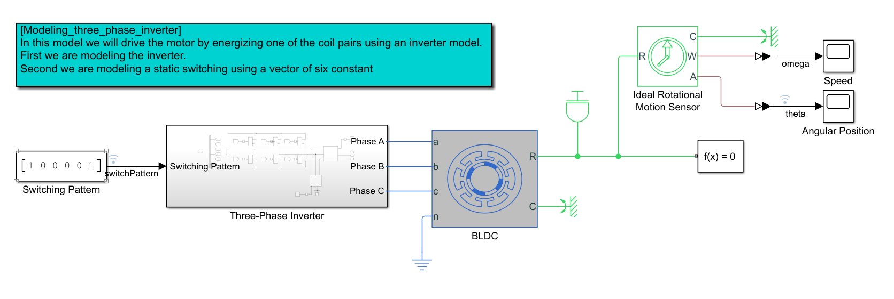

# Simulink implementation simulating the Back-EMF Voltage of a BLDC Motor

## 🛠 Model and Setup

The provided model lets you simulate a BLDC motor which is driven by a three-phase inverter. See the image below.

|  |
| :---------------: |

In the model, the BLDC motor is set up to have a single pole pair in the rotor and the three-phase inverter is driven with a static switching pattern simultaneously energizing phases A and C. The following animation shows the resulting rotor alignment.

| 
  
 | 
  
 |
| :---------------: | :---------------: |

The Three-Phase Inverter has been designed manually in order to better understand its properties.
Note that a [pre-built](https://www.mathworks.com/help/physmod/sps/ref/converterthreephase.html) block is already provided by Simulink.

__Note__: In this simulation you can observe that after the switch of the phases, the rotor reach a stationary angle position of 30 degrees. This is beacause of none other switches are performed.

## Usage

If you want to reproduce the animation above, you have to switch the working directory to the path where the model is located in, then run the script with the following command: `animateRotorPosition_2`  
